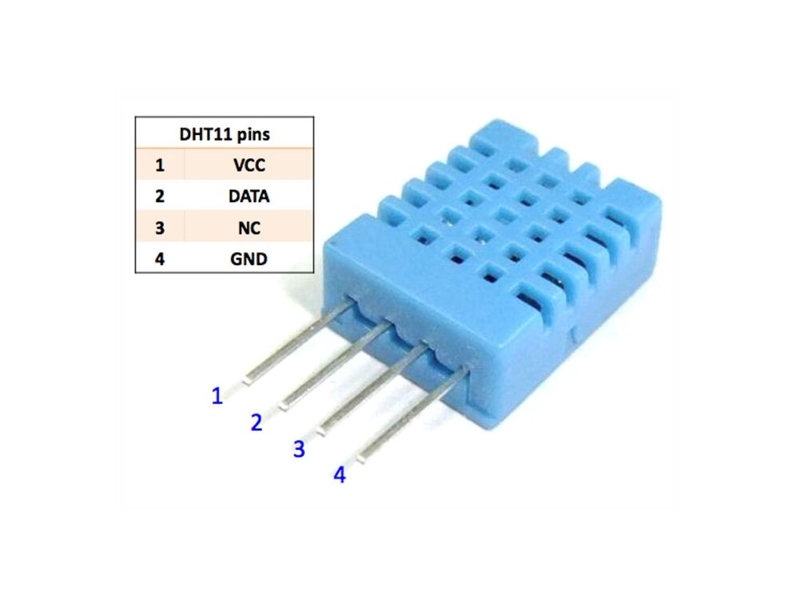

# DHT11 Driver for ESP32

A no_std Rust driver for the DHT11 temperature and humidity sensor designed for ESP32 microcontrollers.

## Features

- **No Standard Library** - Fully compatible with embedded environments
- **ESP32 HAL Integration** - Built with `esp-hal` (v1.0.0-rc.1)
- **Minimal Dependencies** - Lightweight and efficient
- **Temperature & Humidity Readings** - Returns both values in a single read
- **Error Handling** - Comprehensive error types for reliability

## Installation

Add to your `Cargo.toml`:

```toml
[dependencies]
esp32_hal_dht11_driver = "0.1"
```

## Usage

### Basic Example

```rust
use esp32_hal_dht11_driver::DHT11;
use esp_hal::delay::Delay;
use esp_hal::gpio::Flex;

fn main() {
    let delay = Delay::new();
    let mut dht11 = DHT11::new(delay);
    
    // Configure your GPIO pin as a Flex GPIO
    let mut pin = Flex::new(io.gpio2);
    
    loop {
        match dht11.read(&mut pin) {
            Ok(reading) => {
                println!("Temperature: {}°C", reading.temperature);
                println!("Humidity: {}%", reading.humidity);
            }
            Err(error) => {
                eprintln!("Sensor error: {:?}", error);
            }
        }
        
        delay.delay_millis(2000);
    }
}
```

## API

```rust
DHT11::new(delay: Delay) -> Self
```

Creates a new DHT11 instance with a delay provider.

```rust
DHT11::read(&mut self, pin: &mut esp_hal::gpio::Flex) -> Result<Reading, SensorError>
```

Reads temperature and humidity data from the sensor.

**Returns:**
- `Ok(Reading)` - Contains `temperature` (i8) in °C and `humidity` (u8) in %
- `Err(SensorError)` - One of: `Timeout`, `ChecksumMismatch`, or `PinError`

## Supported Platforms

- ESP32 (and variants: ESP32-S3, ESP32-C3, etc.)
- Any ESP32 with GPIO support

## Error Handling

The driver may return the following errors:

- **`SensorError::Timeout`** - Communication timeout with sensor
- **`SensorError::ChecksumMismatch`** - Data integrity check failed
- **`SensorError::PinError`** - GPIO operation failed

Implement proper error handling in your application for robust operation.

## Technical Details

- **Sensor Protocol** - DHT11 digital communication protocol (1-wire)
- **Temperature Range** - -20 to +60°C
- **Humidity Range** - 20% to 95% RH
- **Read Interval** - Minimum 2 seconds between consecutive reads

## Origin

This library is forked from [esp32-dht11-rs](https://github.com/nor236/esp32-dht11-rs) and updated to:
- Remove dependency on the `embedded_hal` crate
- Resolve compatibility issues with various ESP32 HAL crates
- Support `esp-hal` v1.0.0-rc.1

## License

MIT License

## Hardware

